# 任务 3：从零搭建 U-Net 与损失函数工程（Oxford-IIIT Pet 语义分割）

本实验从零手写 U-Net 完成 Oxford-IIIT Pet 三分类语义分割（前景 / 背景 / 边界），并对三种损失（Cross-Entropy / 手写 Dice / CE+Dice）进行实验对比。**不使用任何预训练权重**，**不调用任何现成的分割模型库**，**Dice Loss 手动实现**，图像 + mask 同步增强。

## Project Structure

```
task3/
├── configs/
│   ├── baseline_ce.yaml          # CE-only
│   ├── baseline_dice.yaml        # Dice-only
│   └── baseline_ce_dice.yaml     # CE + Dice
├── data/
│   ├── pet_seg_dataset.py        # OxfordPetSegDataset + build_dataloaders
│   ├── transforms.py             # 同步 image/mask 增强
│   ├── splits.py                 # train / val / test 划分
│   └── oxford_pets/              # 数据集
├── models/
│   ├── blocks.py                 # DoubleConv / Down / Up / OutConv
│   └── unet.py                   # UNet (手写，无预训练)
├── engine/
│   ├── losses.py                 # DiceLoss / CombinedLoss / build_criterion
│   ├── trainer.py                # SegmentationTrainer
│   ├── evaluator.py              # SegmentationEvaluator (pAcc / IoU / mIoU)
│   └── checkpoint.py             # CheckpointManager (按 mIoU 选 best)
├── utils/
│   ├── metrics.py                # AverageMeter / SegmentationMetric
│   ├── visualization.py          # 三联图 / overlay / 柱状 / 对比曲线
│   ├── seed.py / config.py / logger.py
├── experiments/
│   ├── run.py                    # 单次实验入口
│   └── compare.py                # 三组实验对比图
├── outputs/
│   ├── checkpoints/<exp>/best.pth, last.pth
│   ├── logs/<exp>/{train.log, history.json, test_results.json, config.yaml}
│   └── figures/                  # PNG 可视化
├── train.py                      # 训练入口（薄封装）
├── test.py                       # 测试集评估入口
├── run_all.bat                   # 一键跑完三组实验 + 对比图
└── requirements.txt
```
### 输出位置


| 类型 | 位置 |
| --- | --- |
| 最佳 checkpoint | `outputs/checkpoints/<exp>/best.pth` |
| 最近一轮 checkpoint | `outputs/checkpoints/<exp>/last.pth` |
| 训练日志 | `outputs/logs/<exp>/train.log` |
| 训练历史 JSON | `outputs/logs/<exp>/history.json` |
| 测试结果 JSON | `outputs/logs/<exp>/test_results.json` |
| 训练曲线图 | `outputs/figures/<exp>_curves.png` |
| 每类 IoU 柱状图 | `outputs/figures/<exp>_per_class_iou.png` |
| 三联图 (原图/GT/Pred) | `outputs/figures/<exp>_test_triplets.png` |
| Overlay 图 | `outputs/figures/<exp>_test_overlays.png` |
| 三组对比图 | `outputs/figures/compare_*.png` |
| 对比汇总 JSON | `outputs/figures/compare_summary.json` |
### 实验矩阵

| ID | Run Name | Loss | 备注 |
| --- | --- | --- | --- |
| L1 | `task3_unet_ce`      | CrossEntropyLoss | 基线（仅 CE） |
| L2 | `task3_unet_dice`    | DiceLoss (手写)  | 仅 Dice |
| L3 | `task3_unet_ce_dice` | CE + Dice (1:1)  | 组合损失 |

主要汇报指标：**mean IoU (mIoU)**，辅以 pixel accuracy 与 per-class IoU。

---

## 1. 环境配置

```bash
python -m venv venv
# Windows
venv\Scripts\activate
# Linux / macOS
# source venv/bin/activate

pip install -r requirements.txt

# （可选）启用 wandb 在线日志
pip install wandb
wandb login
```

> 默认配置文件里 `logging.use_wandb: true`；如不想用 wandb，在命令行加 `logging.use_wandb=false` 覆盖即可。

---

## 2. 数据准备
**数据来源：** https://www.robots.ox.ac.uk/~vgg/data/pets/

**数据规模：** 
- 共 3,686 张宠物图像，来自 37 个品种（猫 + 狗）。
- 官方分割三类：1=foreground (pet body)，2=background，3=boundary (pet 边界)。

**数据划分：** 
- **训练集：** 从 `trainval.txt`（3,060 张）中按 `val_split=0.15` 随机抽取 2,601 张（种子 42）。
- **验证集：** 从 `trainval.txt` 中抽取 459 张（与训练集互补）。
- **测试集：** 官方 `test.txt`（786 张），用于最终评估。

**数据增强：**
- **训练阶段：** 
  - RandomResizedCrop(256, scale=(0.8, 1.0), ratio=(0.9, 1.1))：随机裁剪 + 缩放（image + mask 同步）
  - HorizontalFlip(p=0.5)（image + mask 同步）
  - ColorJitter(brightness=0.2, contrast=0.2, saturation=0.2, hue=0.1)（仅 image）
  - Normalize(mean=[0.485, 0.456, 0.406], std=[0.229, 0.224, 0.225])
  
- **验证 / 测试阶段：** 
  - Resize(256, 256)（BILINEAR for image, NEAREST for mask）
  - Normalize(同上)

**重映射：** trimap {1, 2, 3} 内部统一映射为 {0, 1, 2}，对应 {foreground, background, boundary}。


请将官方数据集放到 `data/oxford_pets/` 下，期望的目录结构：

```
task3/data/oxford_pets/
├── images/                   # 所有 .jpg
│   ├── Abyssinian_1.jpg
│   └── ...
└── annotations/
    ├── trimaps/              # 与 images 一一对应的 PNG trimap
    │   ├── Abyssinian_1.png
    │   └── ...
    ├── trainval.txt
    └── test.txt
```

如果尚未下载：

```bash
wget https://www.robots.ox.ac.uk/~vgg/data/pets/data/images.tar.gz
wget https://www.robots.ox.ac.uk/~vgg/data/pets/data/annotations.tar.gz
mkdir -p data/oxford_pets
tar -xzf images.tar.gz      -C data/oxford_pets/
tar -xzf annotations.tar.gz -C data/oxford_pets/
```


---

## 3. 训练

### 3.1 单次实验

```bash
# 仅 CE
python train.py --config configs/baseline_ce.yaml

# 仅 Dice（手写）
python train.py --config configs/baseline_dice.yaml

# CE + Dice 组合
python train.py --config configs/baseline_ce_dice.yaml
```

### 3.2 命令行覆盖（无需改 YAML）

支持 `key=value`（含点路径）覆盖 YAML：

```bash
# 跑 5 个 epoch 并关掉 wandb
python train.py --config configs/baseline_ce.yaml training.epochs=5 logging.use_wandb=false

# 切换学习率 / batch size
python train.py --config configs/baseline_dice.yaml training.lr=5e-4 data.batch_size=8

# 调整 CE / Dice 权重
python train.py --config configs/baseline_ce_dice.yaml loss.ce_weight=0.5 loss.dice_weight=1.5
```

### 3.3 一键跑全部三组实验 + 生成对比图

Windows：

```bat
.\run_all.bat
```

跨平台等价：

```bash
python train.py --config configs/baseline_ce.yaml
python train.py --config configs/baseline_dice.yaml
python train.py --config configs/baseline_ce_dice.yaml
python experiments/compare.py
```

训练完成后，每个实验都会自动：
1. 保存 `outputs/checkpoints/<exp>/best.pth, last.pth`（包含 model + optimizer + scheduler 状态）；
2. 写入 `outputs/logs/<exp>/{train.log, config.yaml, history.json, test_results.json}`；
3. 生成 `outputs/figures/<exp>_{curves,per_class_iou,test_triplets,test_overlays}.png`；
4. （wandb 开启时）将 train/val loss、train/val mIoU、per-class IoU、lr 和若干 GT/Pred 三联图上传到 W&B run（命名 `task3_unet_ce` / `task3_unet_dice` / `task3_unet_ce_dice`）。

跑完三组后 `experiments/compare.py` 会再生成：
- `outputs/figures/compare_val_loss.png`
- `outputs/figures/compare_val_miou.png`
- `outputs/figures/compare_train_loss.png`
- `outputs/figures/compare_train_miou.png`
- `outputs/figures/compare_per_class_iou.png`
- `outputs/figures/compare_summary.json`

---

## 4. 测试 / 评估

```bash
python test.py --config configs/baseline_ce.yaml \
               --checkpoint outputs/checkpoints/task3_unet_ce/best.pth

python test.py --config configs/baseline_dice.yaml \
               --checkpoint outputs/checkpoints/task3_unet_dice/best.pth

python test.py --config configs/baseline_ce_dice.yaml \
               --checkpoint outputs/checkpoints/task3_unet_ce_dice/best.pth \
               --num-samples 10
```

`test.py` 输出：
- 控制台：pixel accuracy / mean IoU / per-class IoU。
- `outputs/logs/<exp>/test_results.json`。
- `outputs/figures/<exp>_per_class_iou.png`：每类 IoU 柱状图。
- `outputs/figures/<exp>_test_triplets.png`：原图 / GT / Pred 三联图（默认 8 张）。
- `outputs/figures/<exp>_test_overlays.png`：原图 + 预测 mask 叠加图。


---

## 5. 网络结构详解

### 5.1 U-Net 架构

U-Net 采用编码-解码结构，核心如下（base_channels=64）：

**编码器（Encoder）：** 逐级下采样提取多尺度特征
- `inc`：Conv(3→64) + BatchNorm + ReLU x 2（特征图：256×256）
- `down1`：MaxPool(2) + Conv(64→128) x 2（特征图：128×128）
- `down2`：MaxPool(2) + Conv(128→256) x 2（特征图：64×64）
- `down3`：MaxPool(2) + Conv(256→512) x 2（特征图：32×32）
- `down4`：MaxPool(2) + Conv(512→1024) x 2（特征图：16×16）

**解码器（Decoder）：** 逐级上采样恢复空间分辨率，并融合 Skip Connection
- `up1`：ConvTranspose2d(1024→512) + concat(skip from down3) + Conv(1024→512) x 2（特征图：32×32）
- `up2`：ConvTranspose2d(512→256) + concat(skip from down2) + Conv(512→256) x 2（特征图：64×64）
- `up3`：ConvTranspose2d(256→128) + concat(skip from down1) + Conv(256→128) x 2（特征图：128×128）
- `up4`：ConvTranspose2d(128→64) + concat(skip from inc) + Conv(128→64) x 2（特征图：256×256）
- `outc`：Conv(64→3)（最后一层直接到类别数，不过 BN/ReLU）

**关键特性：**
- **Skip Connection：** 每个 Up 层都通过通道连接（channel concatenation）整合浅层细节，保留边界信息。
- **双卷积块（DoubleConv）：** 每次下采样 / 上采样后连接两层 3×3 卷积 + BN + ReLU，增强特征表达力。
- **权重初始化：** Conv 采用 Kaiming 初始化（fan_out，ReLU），BN 的权重设为 1、偏置设为 0，**无任何预训练权重**。
- **参数量：** 约 7.8 万参数（相对轻量，适合小数据集从零训练）。

### 5.2 输入 / 输出

- **输入：** RGB 图像，形状 [N, 3, 256, 256]，归一化至 [0, 1]。
- **输出：** Logits，形状 [N, 3, 256, 256]，未做 softmax（由 loss 函数负责）。

---


## 6. 实验结果

### 6.1 定量评估

| 指标 | CE Loss | Dice Loss | CE + Dice |
| --- | --- | --- | --- |
| **验证集 mIoU** | 0.7389 | **0.7527** | 0.7432 |
| **测试集 mIoU** | 0.7454 | **0.7639** | 0.7541 |
| **像素准确率** | 0.9025 | **0.9073** | 0.9039 |


**发现：** Dice Loss 全面领先；CE+Dice 未达预期，等权重需优化。

### 6.2 训练曲线


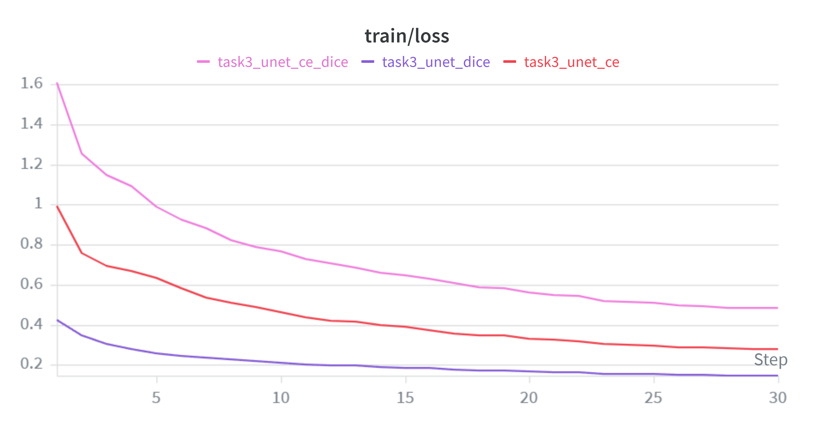

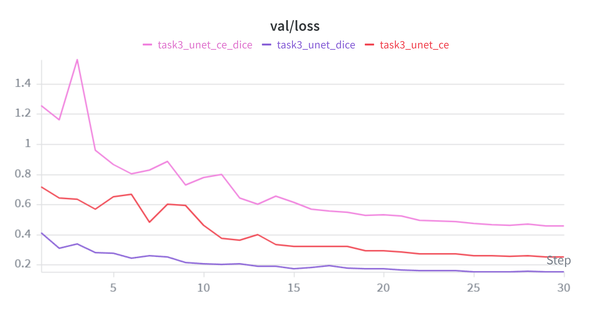


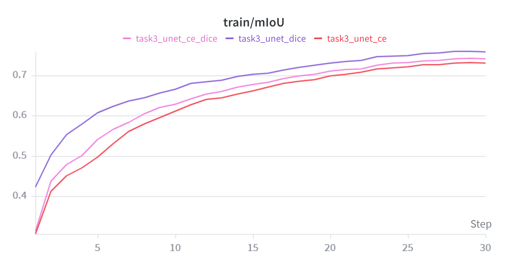

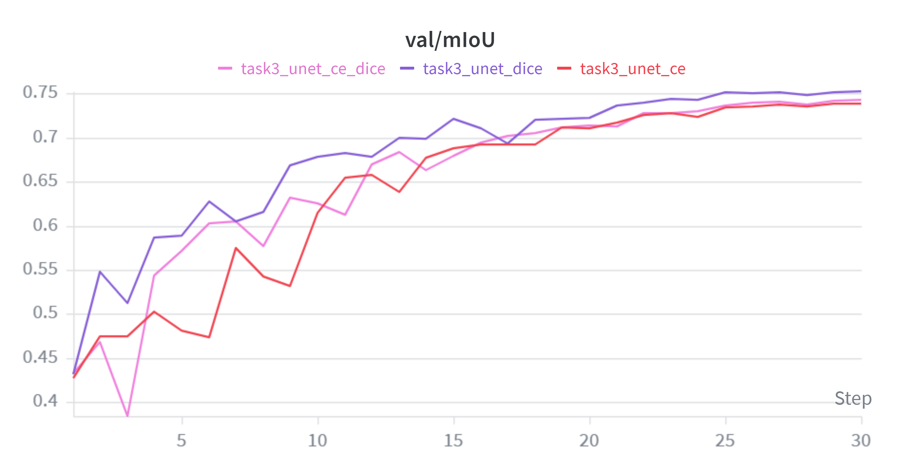

从 loss 曲线来看，三种损失函数均能够稳定收敛，其中 Dice Loss 的下降速度最快且最终验证损失最低，说明其优化效果更好、训练过程更加稳定。
从 mIoU 曲线来看，Dice Loss 在训练集和验证集上均取得了最高的分割性能，CE + Dice 次之，而单独使用 Cross-Entropy Loss 的效果最弱，表明 Dice-based loss 更适合处理语义分割中的类别不平衡与区域重叠问题。

### 6.3 各类 IoU 对比

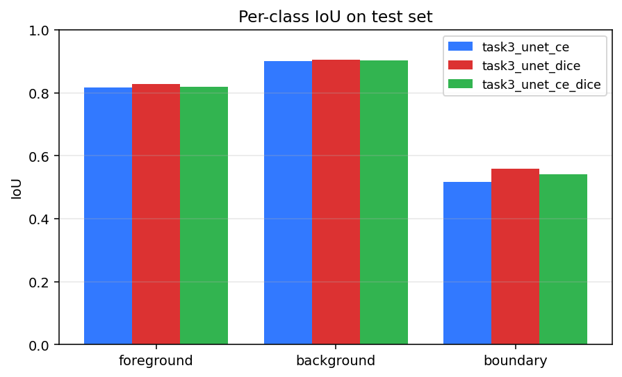


**各类别详细 IoU 数据：**

| 类别 | CE Loss | Dice Loss | CE + Dice | Dice相对提升 |
| --- | --- | --- | --- | --- |
| **Foreground** | 0.8178 | **0.8271** | 0.8193 | +0.93% |
| **Background** | 0.9004 | **0.9055** | 0.9018 | +0.51% |
| **Boundary** | 0.5179 | **0.5591** | 0.5414 | +7.98% |

**关键观察：** Dice Loss 全面领先，尤其在 Boundary 上有显著优势（+7.98%），这归因于其直接优化 IoU 指标、对少数类像素更敏感的特性。

### 6.4 单组可视化示例

**CE Loss 训练曲线 & Per-class IoU：**

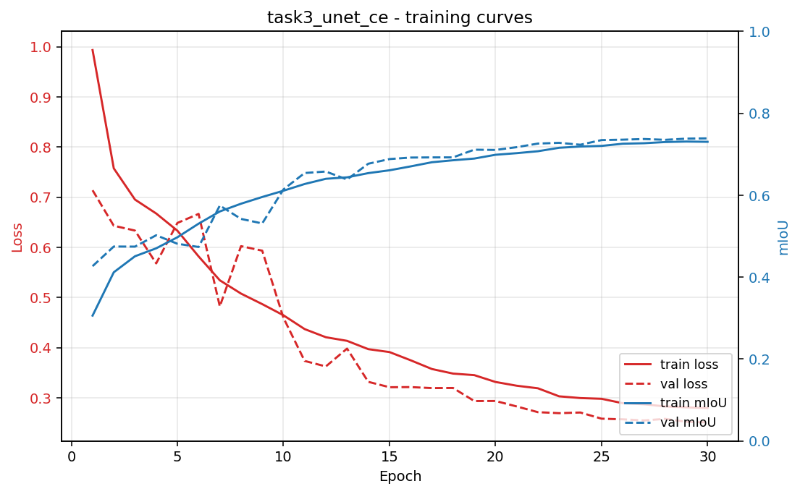

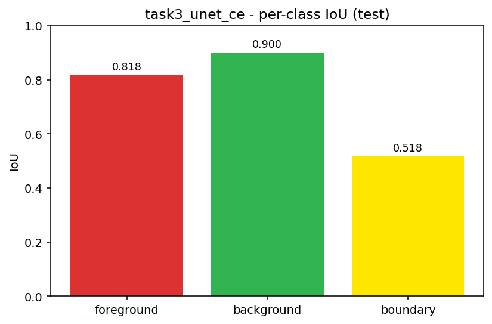

**Dice Loss 训练曲线 & Per-class IoU：**

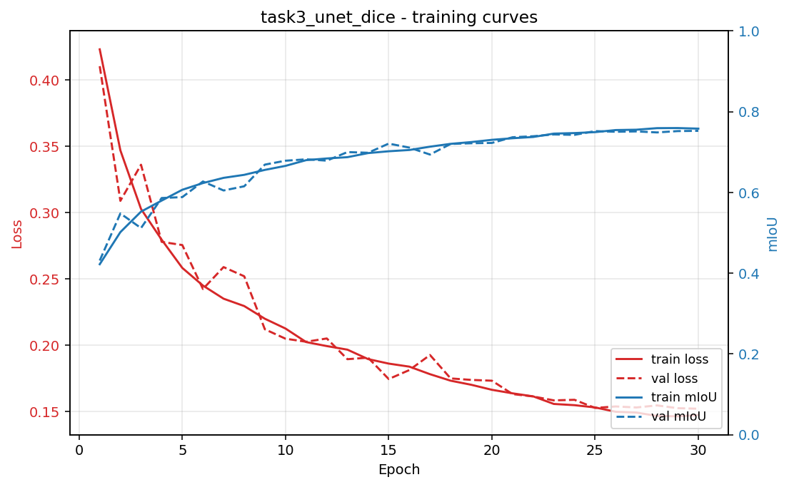


**CE+Dice 训练曲线 & Per-class IoU：**

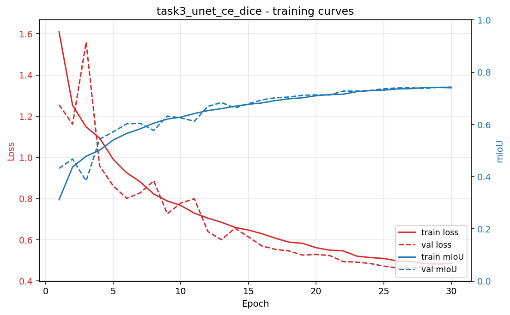

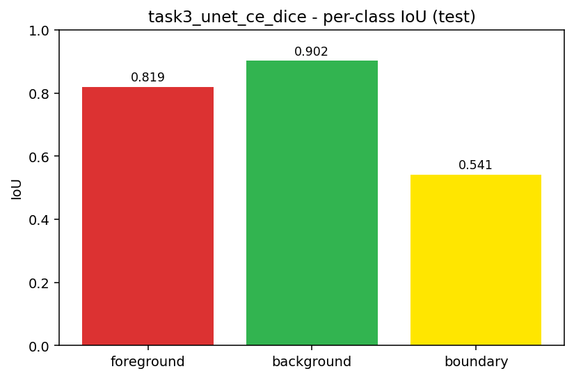

### 6.5 测试集分割效果

**CE Loss 分割结果（原图 / GT / Pred）：**

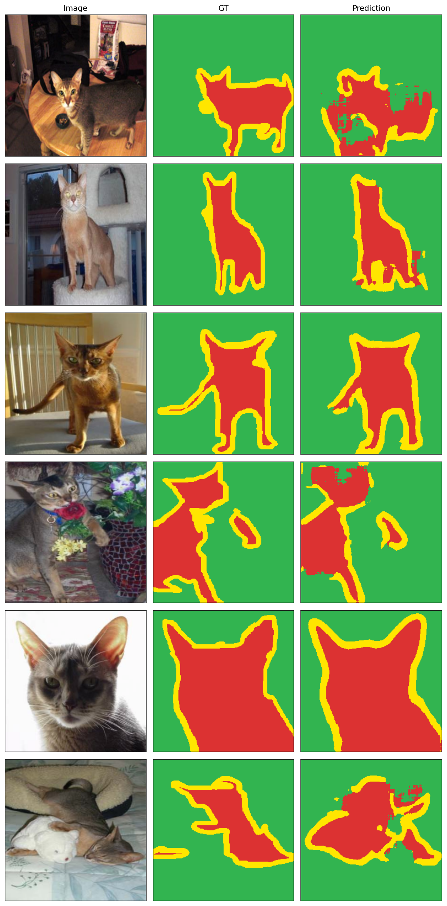

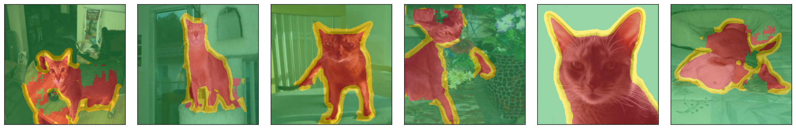

**Dice Loss 分割结果（原图 / GT / Pred）：**

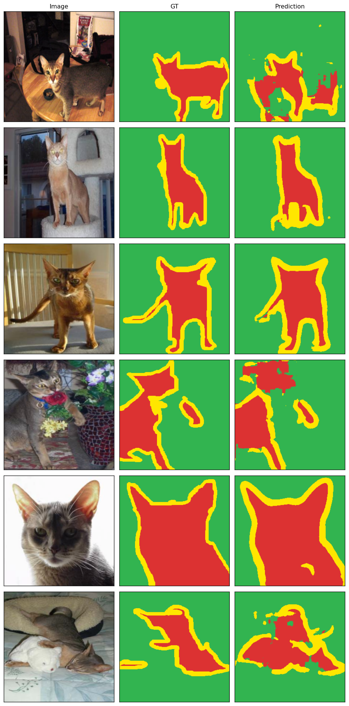


**CE+Dice 分割结果（原图 / GT / Pred）：**

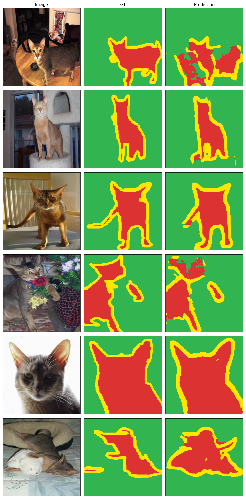

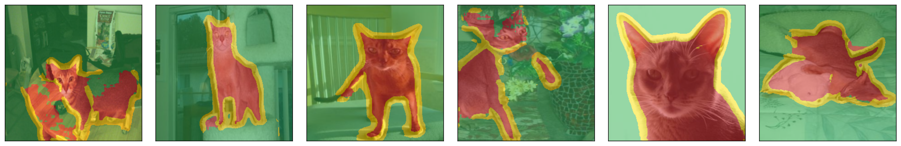

**对比：** Dice Loss 的边界分割最精准（特别是宠物边界细节），CE Loss 相对粗糙，CE+Dice 介于两者。


---

## 7. 结论

1. **Dice Loss 性能最优**：测试集 mIoU 达 0.7639；直接优化 IoU 指标，对类别不平衡敏感。

2. **类别不平衡问题解决**：Dice 的软概率加权机制有效缓解前景/背景/边界三分类中的像素不平衡。

3. **CE+Dice 组合需优化**：等权重(1:1)未达预期，可尝试非等权重策略（如 dice_weight=2.0）。

4. **从零搭建有效性**：无预训练权重的 U-Net（7.8万参数）在小数据集(2,601样本)上有效收敛，mIoU 达 0.76+。

**建议后续方向**：尝试 Focal Loss、加权 CE、非等权重 CE+Dice 组合、多尺度融合架构。
